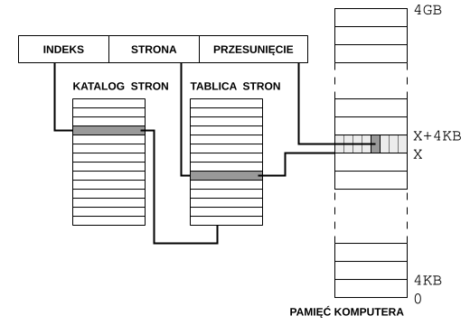

# X86

Jest to rodzina architektur procesorów Intel. Początkowo 16-bitowe, teraz 32 i 64.
Najważniejsze cechy to:

### Kompatybilność wsteczna
pozwala uruchomić starsze oprogramowanie na nowszych procesorach

### CISC (Complex Instruction Computing)
procesory obsługują rozbudowany zestaw instrukcji, które mogą wykonywać złożone operacje w ramach pojedynczej instrukcji

### Tryb rzeczywisty i tryb chroniony
- tryb rzeczywisty - dostęp do pamięci w sposób zgodny z wcześniejszymi procesorami
- tryb chroniony - zaawansowane zarządzanie pamięcią, w tym ochrona pamięci oraz korzystanie z segmentacji i paginacji pamięci

### Wielordzeniowość
wyposażone w wiele rdzeni, mogą wykonywać wiele wątków jednocześnie

# Rejestry procesorów x86
rejestrami nazywamy komórki pamięci w procesorze.
Pierwsza litera zazwyczaj jest skrótem od funkcji jaką pełnią

### Wyróżniamy rejestry:
- **Rejestry ogólnego przeznaczenia (GPR)**:
    - **AX (accumulator)** - przeważnie stosujemy do większości obliczeń, są w nim umieszczane wyniki operacji arytmetycznych.
    - **BX (base)** - przechowuje adresy (indeksowanie pamięci)
    - **CX (count)** - licznik w pętlach i instrukcjach powtórzeniowych
    - **DX (data)** - - też często stosowany do przechowywania wyników niektórych operacji jeśli wynik nie mieści się w AX
- **rejestry segmentowe** - adresowanie pamięci
    - CS, DS, ES, SS 
- **rejestry wskaźnikowe**
    - najważniejsze to SP czyli wskaźnik stosu i BP czyli wskaźnik bazy

### Najważniejsze flagi
 - **CF (carry)** - flaga ustawiona jeśli nastąpiło przeniesienie czyli wynik danej operacji nie mieści się w rozmiarze zmiennej
 - **PF (Parity flag)** - flaga parzystości, ustawiona jeśli ilość bitów o wartości 1 w najmniej znaczącym bajcie wyniku ostatniej operacji jest parzysta
 - **SF (sign flag)** - ustawiona na najbardziej znaczący bit ostatniej operacji
 - **OF (nie jest to only fans tylko overflow)** - ustawiony bit oznacza że w ostatniej operacji nastąpiło przeniesienie lub pożyczka z bitu znaku
 - **ZF (zero flag)** znaczy że wynik ostatniej operacji to 0

### Przerwania (Interrupts)
sygnalizuje procesorowi konieczność obsługi sytuacji wyjątkowych, które nie należą do wykonywanego strumienia instrukcji.
- **przerwania programowe** - wywoływane przez użycie rozkazów procesora
- **przerwania sprzętowe** - spoza procesora, zgłaszają urządzenia  zewnętrzne.

# Pamięć logiczna i fizyczna
- adres wytworzony przez procesor to adres logiczny
- odwzorowanie adresów logicznych na fizyczne odbywające się podczas działania programu jest dokonywane przez jednostkę zarządzania pamięcią.

# Stronicowanie
stronicowanie pto sposób przechowywania pamięci w sposób nieciągły. 
- pamięc fizyczna dzielona jest na bloki o stałej długości zwane ramkami
- pamięć logiczna dzielona jest na bloki stałej długości zwane stronami
- przy wykonywaniu procesu, strony z pamieci pomocniczej wprowadzane są w odpowiednie ramkami

Jeśli włączone jest stronicowanie, wówczas cała pamięć (4 GB) dzielona jest na bloki – strony o rozmiarach 4 kB
Gdy program odwołuje się do pamięci, podaje adres właściwej komórki pamięci. Adres ten jest 32-bitową liczbą, która składa się z trzech części:

- indeks w katalogu stron (liczba 10-bitowa),
- indeks w tablicy stron (liczba 10-bitowa),
- przesunięcie w obrębie strony (liczba 12-bitowa).

Katalog stron zawiera wskaźniki do tablic stron, tablice stron przechowują adresy fizyczne stron. (System operacyjny może zarządzać wieloma katalogami i tablicami stron).

# Segmentacja
Segmentacja pamięci jest metodą alternatywną do stronicowania. Chociaż może ona być używana samodzielnie, to najczęściej jest wykorzystywana w połączeniu ze stronicowaniem. W segmentacji proces jest podzielony na pewne części (segmenty). Każdy segment może mieć różną długość i różne prawa dostępu (Rys. 9). Intuicyjnie wiążą się one z funkcjami segmentów.
Podobnie jak przy stronicowaniu, istnieje tablica segmentów, która je opisuje. Znajdują się w niej adres startowy segmentu, jego rozmiar, prawa dostępu i inne dane. Segmenty mogą być dowolnie porozrzucane po pamięci RAM. Adres w tym przypadku składa się z dwóch elementów: 16 bitowego selektora segmentu i 32 bitowego (bądź 64 bitowego w systemach 64 bitowych) przesunięcia. Sposób tworzenia adresu jest pokazany na rysunku 10. Selektor segmentu wskazuje na odpowiedni element w tablicy segmentów. Tablica ta jest nazywana tablicą deskryptorów.

