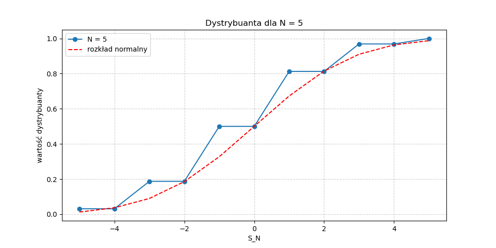

# Zadanie domowe 4.

## zadanie 1

Najpierw zajmijmy się wyznaczeniem E(X) i var(X) wiedząc, że X ma rozkład Bin(n, 1/2).

E(X) = n * 1/2 = n/2

var(x) = n * 1/2 * (1 - 1/2) = n/4

a) Podstawiając do nierówności Markova otrzymujemy:
    P(X >= 3n/5) <= n/2 * 5/(3n)
    P(X >= 3n/5) <= 5/6

Z kolei jeśli spróbujemy to obliczyć przy pomocy nierówności Czebyszewa to musimy to przekształcić do postaci:
    P(X - E(X) >= E(x) * 1/5) <= var(X) / (E(X) * 1/5)^2
    P(X - n/2 >= n/10) <= n/4 / (n/10)^2
    P(X - n/2 >= n/10) <= 25/n

b) Podstawiając do nierówności Czebyszewa:
    P(|X - n/2| >= n/20) <= 100/n

Z nierówności Markova:
    P(X >= 11n/20) <= n/2 * 20/(11n)
    P(X >= 11n/20) <= 20/22

w celu obliczenia dokładnych wartości skorzystałem z pakietu scipy.stats

jak widać oszacowanie za pomocą nierówności Czebyszewa jest przeważnie dokładniejsze.
Ponadto im większe n tym bardziej dokładne oszacowanie Czebyszewa

## zadanie 2

Poniżej zamieszczam wykresy przedstawiające dystrybuantę zmiennej S dla parametrów N = {5, 10, 15, 25, 30, 100} oraz dystrybuantę rozkładu normalnego, który aproksymuje rozkład S_N

Z wykresów widać, że wraz ze wzrostem N rozkład wartości S_N​ coraz bardziej przypomina rozkład normalny. Wynika to z centralnego twierdzenia granicznego, które mówi, że suma (lub średnia) dużej liczby niezależnych zmiennych losowych o skończonej wariancji dąży do rozkładu normalnego, niezależnie od pierwotnego rozkładu tych zmiennych.

## zadanie 3

Poniżej zamieszczam histogramy, które reprezentują oszacowane wartości funkcji masy prawdopodobieństwa zmiennej losowej P_N, dla wartosci N {100, 1000, 10000}.

Histogramy PMF dla P_N wykazują kształt charakterystyczny dla rozkładu arcusa sinus: wartości skrajne (blisko 0 i 1) są częstsze niż wartości środkowe.
Oprócz tego widać, że podobnie jak w poprzednim zadaniu im większe N tym bardziej widać to zbliżenie do PDF arcusa sinus. 
Można z tego wywnioskować, że jeżeli proces zacznie spędzać więcej czasu nad lub pod osią X to ma tendencję do utrzymania tego stanu przez dłuższy czas.